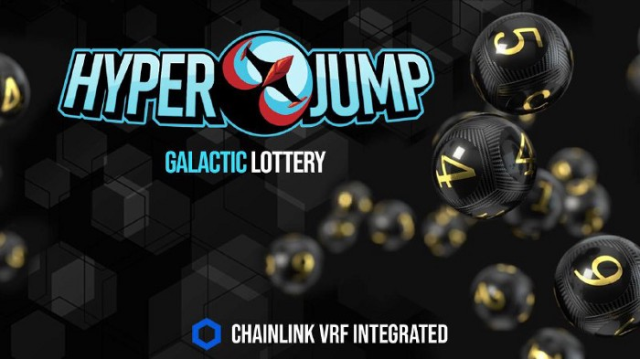
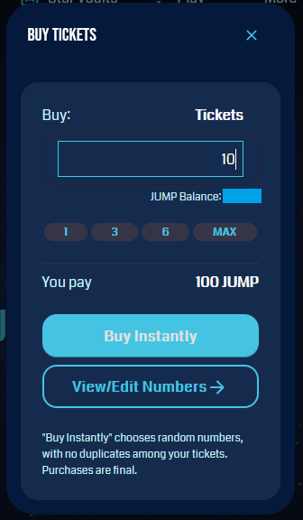
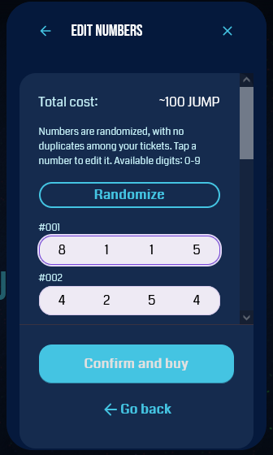

---
Use $JUMP to play in the Galactic Lottery
---

# Galactic Lottery

### How To Pay

To play, users must buy a lottery ticket, The purchase process is very easy, users just have to go to the [Galactic Lottery](https://ftm.hyperjump.app/lottery) section and click on "Buy Tickets"

Then, a purchase tab will appear, users must select the number of tickets they want to buy, users can type the number of tickets they want to buy or use the quick select buttons, each ticket costs 10 $JUMP.

To confirm the purchase, the user can click on "buy instantly" and random tickets will be generated.

To change the number of tickets, the user can click on "view / edit numbers"

In this section the user can click on "randomize" to generate tickets with random numbers, each ticket will be unique

Users can also change the numbers manually to choose the best option

Once finished, the user must click on "Confirm and buy"

To see the tickers that the user has bought, just go to the galactic lottery section and click on "View your tickets"

### How to win?

To win, the numbers and their position on ticket must match the winning number in the exact same order, starting from the first digit.

If the winning number is “123456” , then “120000” matches the first 2 digits; “000006” matches the last digit, but since the first five digits are wrong, it does not win any prize.

### How is the distribution of the prizes? 

From the total amount of the prize, 80% will be distributed among the winners and 20% will be burned forever!

The total jackpot for winners will be distributed as follows:

With 4 matches you win 50% of the pot

With 3 matches you win 25% of the pot

With 2 matches you win 15% of the pot

With 1 match you win 10% of the pot

(If there is more than 1 winner, the pot to be distributed will be divided among the number of winners, in case there is no winner, the prize will be accumulated for the next round).

### Galactic lottery example 

Suppose our ticket has the numbers “7–7–0–1”

.png>)

Lottery rounds will be repeated every 84 hours (3.5 days). That means community can enjoy 2 lotteries each week!

### HyperJump is SAFU! 

.png>)

Our priority is transparency, safety, quality and technology, that is why we have decided to integrate Chainlink’s VRF technology to the Galactic Lottery!

By integrating the industry-leading decentralized oracle network, we now have access to a tamper-proof and auditable source of randomness needed to select the Galactic Lottery winners. Ultimately this creates a more exciting, transparent, and fraud-proof user experience, so users can relax and have fun with our multi-chain Galactic Lottery.

In order to ensure transparency and security when selecting the winners of the Galactic Lottery, we need access to a secure random number generator (RNG) that any user could independently audit the lottery results. However, RNG solutions for smart contracts require several security considerations to prevent manipulation and ensure system integrity. For instance, RNG solutions derived from blockchain data like block hashes can be exploited by miners/validators, while off-chain RNG solutions derived from off-chain APIs are opaque and don’t provide users with definitive proof about the integrity of the process.

After reviewing various solutions, we selected Chainlink VRF because it’s based on cutting-edge academic research, supported by time-tested oracle infrastructure, and secured through the generation and on-chain verification of cryptographic proofs that prove the integrity of each random number supplied to smart contracts.

